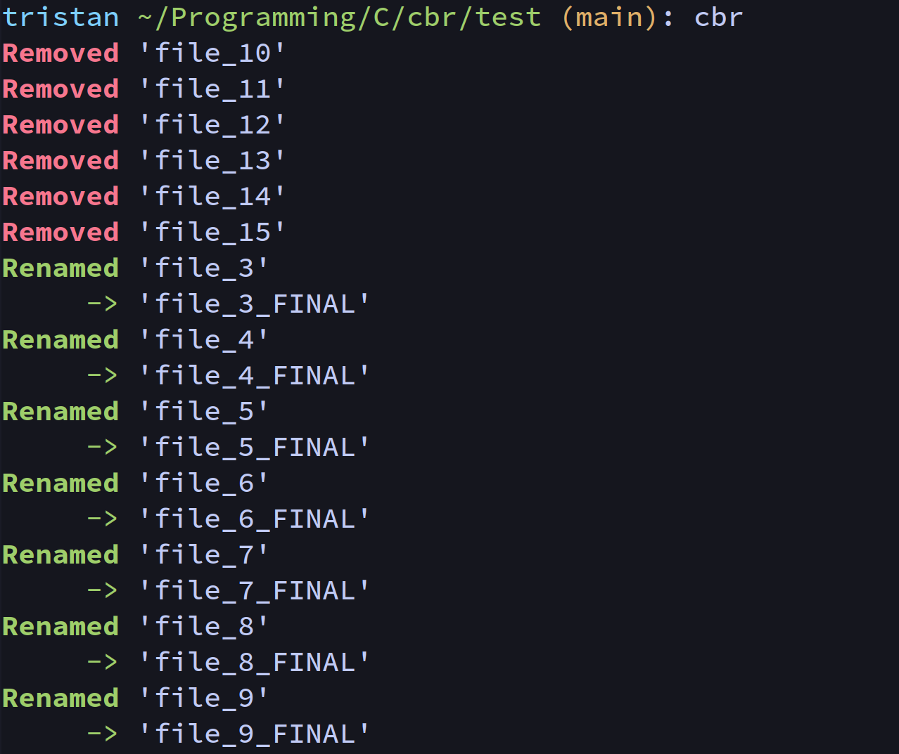

# cbr



### Overview

cbr is a lightweight bulk file renaming utility. It is only available for Linux systems.

---

### Usage
```
cbr - C Bulk Renaming (Utility)

This utility lets you batch-rename files using a text editor. Files to be
renamed should be supplied as a list of command-line arguments, e.g.

  $ cbr *.mp3

The list of files will be opened in the editor specified by the $VISUAL
environment variable, one filename per line. Edit the list, save and exit. The
files will be renamed to the edited filenames. Directories and special files
(e.g. sockets) cannot be renamed.

If the input file list is empty, cbr defaults to listing the contents of the
current working directory.

cbr supports cycle-renaming, as in you can safely rename A to B, B to C and C
to A in a single operation.

You can delete a file by prefixing its name with the delete character (by
default '#'). Deleted files will be fully removed unless -t/--trash is
specified, in which case they will be moved to the system's recycle bin. Trash
functionality requires the gio program from GLib.

  -d, --delchar=CHARACTER    Specify what deletion mark to use. Default '#'
  -e, --editor=PROGRAM       Specify what editor to use
  -f, --force                Allow overwriting of existing files
  -s, --silent               Only report errors
  -t, --trash                Send files to trash instead of deleting them.
  -?, --help                 Give this help list
      --usage                Give a short usage message
  -V, --version              Print program version
```
---

### Motivation

`cbr` closely follows the design and can be considered a reimplementation of the Rust program [vimv](https://github.com/dmulholl/vimv), developed by Darren Mulholland. `vimv` is perfectly good, but I never liked having to install the entire Rust toolchain just to use one small program.

Therefore, cbr exists as a C-based alternative to `vimv`.
